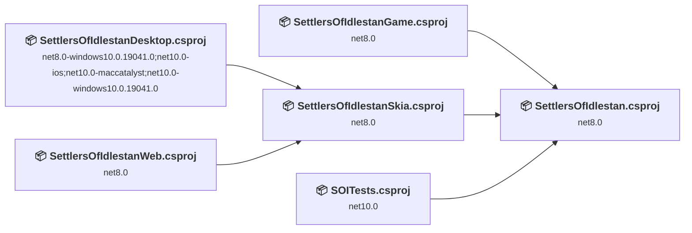
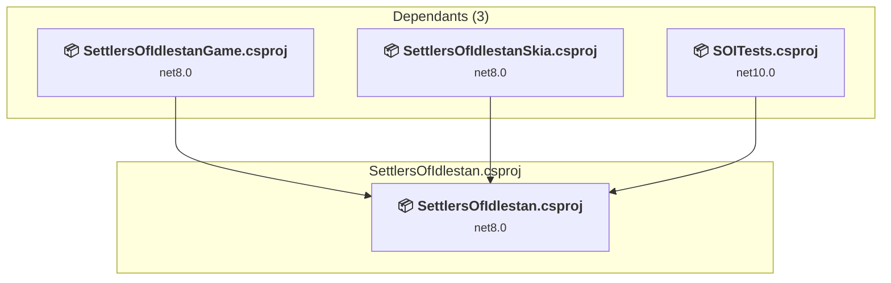
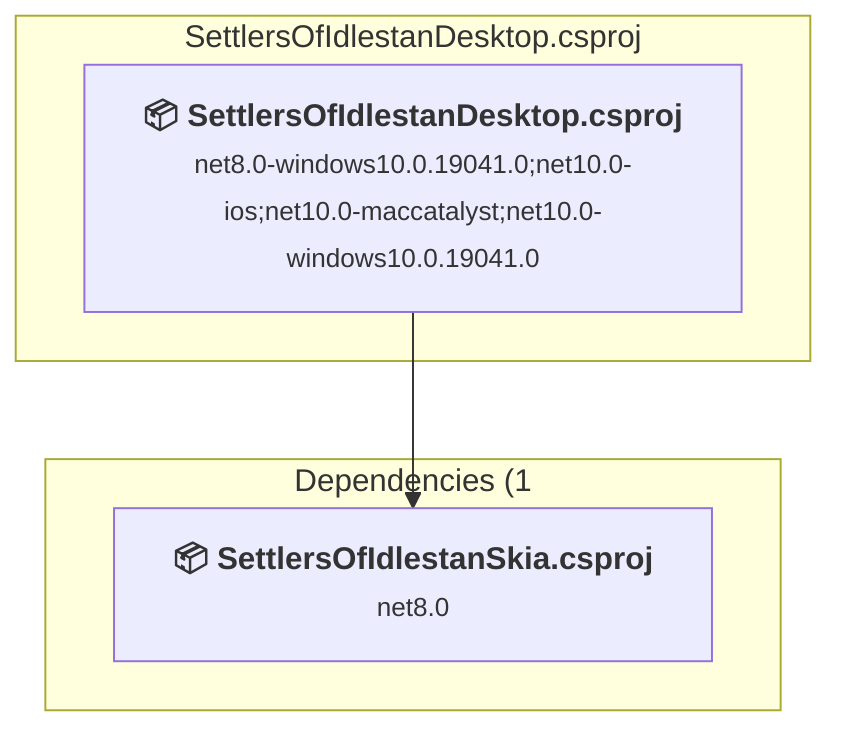
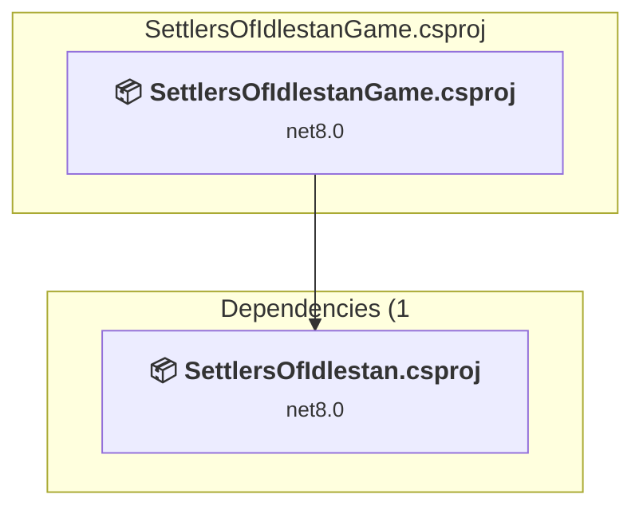
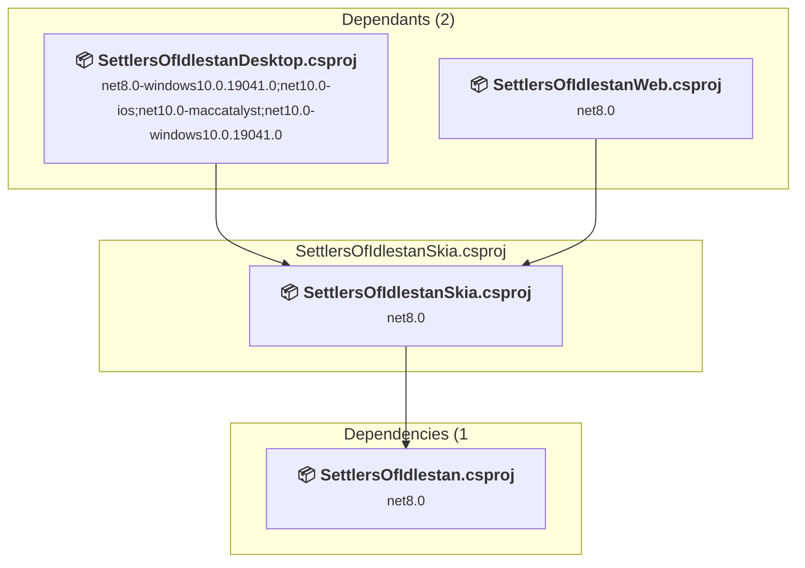
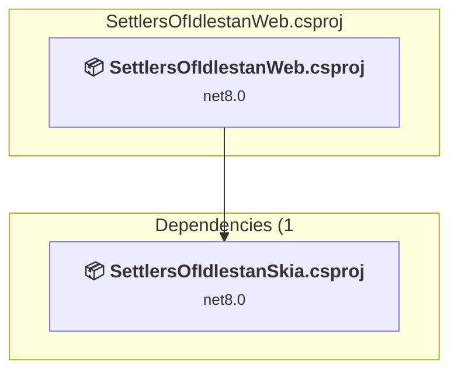
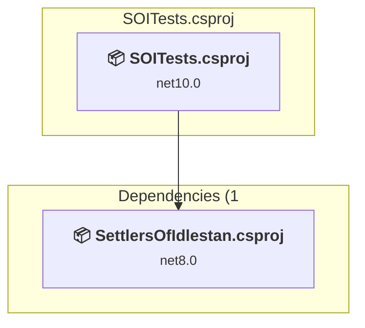

# Projects and dependencies analysis

This document provides a comprehensive overview of the projects and their dependencies in the context of upgrading to .NETCoreApp,Version=v10.0.

## Table of Contents

- [Executive Summary](#executive-Summary)
  - [Highlevel Metrics](#highlevel-metrics)
  - [Projects Compatibility](#projects-compatibility)
  - [Package Compatibility](#package-compatibility)
  - [API Compatibility](#api-compatibility)
- [Aggregate NuGet packages details](#aggregate-nuget-packages-details)
- [Top API Migration Challenges](#top-api-migration-challenges)
  - [Technologies and Features](#technologies-and-features)
  - [Most Frequent API Issues](#most-frequent-api-issues)
- [Projects Relationship Graph](#projects-relationship-graph)
- [Project Details](#project-details)

  - [SettlersOfIdlestan\SettlersOfIdlestan.csproj](#settlersofidlestansettlersofidlestancsproj)
  - [SettlersOfIdlestanDesktop\SettlersOfIdlestanDesktop.csproj](#settlersofidlestandesktopsettlersofidlestandesktopcsproj)
  - [SettlersOfIdlestanGame\SettlersOfIdlestanGame.csproj](#settlersofidlestangamesettlersofidlestangamecsproj)
  - [SettlersOfIdlestanSkia\SettlersOfIdlestanSkia.csproj](#settlersofidlestanskiasettlersofidlestanskiacsproj)
  - [SettlersOfIdlestanWeb\SettlersOfIdlestanWeb.csproj](#settlersofidlestanwebsettlersofidlestanwebcsproj)
  - [SOITests\SOITests.csproj](#soitestssoitestscsproj)

## Executive Summary

### Highlevel Metrics

| Metric | Count | Status |
| :--- | :---: | :--- |
| Total Projects | 6 | 5 require upgrade |
| Total NuGet Packages | 10 | 5 need upgrade |
| Total Code Files | 82 |  |
| Total Code Files with Incidents | 12 |  |
| Total Lines of Code | 6023 |  |
| Total Number of Issues | 28 |  |
| Estimated LOC to modify | 18+ | at least 0,3% of codebase |

### Projects Compatibility

| Project | Target Framework | Difficulty | Package Issues | API Issues | Est. LOC Impact | Description |
| :--- | :---: | :---: | :---: | :---: | :---: | :--- |
| [SettlersOfIdlestan\SettlersOfIdlestan.csproj](#settlersofidlestansettlersofidlestancsproj) | net8.0 | 🟢 Low | 0 | 14 | 14+ | ClassLibrary, Sdk Style = True |
| [SettlersOfIdlestanDesktop\SettlersOfIdlestanDesktop.csproj](#settlersofidlestandesktopsettlersofidlestandesktopcsproj) | net8.0-windows10.0.19041.0;net10.0-ios;net10.0-maccatalyst;net10.0-windows10.0.19041.0 | 🟢 Low | 1 | 0 |  | DotNetCoreApp, Sdk Style = True |
| [SettlersOfIdlestanGame\SettlersOfIdlestanGame.csproj](#settlersofidlestangamesettlersofidlestangamecsproj) | net8.0 | 🟢 Low | 2 | 3 | 3+ | AspNetCore, Sdk Style = True |
| [SettlersOfIdlestanSkia\SettlersOfIdlestanSkia.csproj](#settlersofidlestanskiasettlersofidlestanskiacsproj) | net8.0 | 🟢 Low | 0 | 0 |  | ClassLibrary, Sdk Style = True |
| [SettlersOfIdlestanWeb\SettlersOfIdlestanWeb.csproj](#settlersofidlestanwebsettlersofidlestanwebcsproj) | net8.0 | 🟢 Low | 2 | 1 | 1+ | AspNetCore, Sdk Style = True |
| [SOITests\SOITests.csproj](#soitestssoitestscsproj) | net10.0 | ✅ None | 0 | 0 |  | DotNetCoreApp, Sdk Style = True |

### Package Compatibility

| Status | Count | Percentage |
| :--- | :---: | :---: |
| ✅ Compatible | 5 | 50,0% |
| ⚠️ Incompatible | 0 | 0,0% |
| 🔄 Upgrade Recommended | 5 | 50,0% |
| ***Total NuGet Packages*** | ***10*** | ***100%*** |

### API Compatibility

| Category | Count | Impact |
| :--- | :---: | :--- |
| 🔴 Binary Incompatible | 0 | High - Require code changes |
| 🟡 Source Incompatible | 5 | Medium - Needs re-compilation and potential conflicting API error fixing |
| 🔵 Behavioral change | 13 | Low - Behavioral changes that may require testing at runtime |
| ✅ Compatible | 4897 |  |
| ***Total APIs Analyzed*** | ***4915*** |  |

## Aggregate NuGet packages details

| Package | Current Version | Suggested Version | Projects | Description |
| :--- | :---: | :---: | :--- | :--- |
| Microsoft.AspNetCore.Components.WebAssembly | 10.0.5 | 10.0.6 | [SettlersOfIdlestanWeb.csproj](#settlersofidlestanwebsettlersofidlestanwebcsproj) | La mise à niveau du package NuGet est recommandée |
| Microsoft.AspNetCore.Components.WebAssembly | 8.0.0 | 10.0.6 | [SettlersOfIdlestanGame.csproj](#settlersofidlestangamesettlersofidlestangamecsproj) | La mise à niveau du package NuGet est recommandée |
| Microsoft.AspNetCore.Components.WebAssembly.DevServer | 10.0.5 | 10.0.6 | [SettlersOfIdlestanWeb.csproj](#settlersofidlestanwebsettlersofidlestanwebcsproj) | La mise à niveau du package NuGet est recommandée |
| Microsoft.AspNetCore.Components.WebAssembly.DevServer | 8.0.0 | 10.0.6 | [SettlersOfIdlestanGame.csproj](#settlersofidlestangamesettlersofidlestangamecsproj) | La mise à niveau du package NuGet est recommandée |
| Microsoft.Extensions.Logging.Debug | 10.0.0 | 10.0.6 | [SettlersOfIdlestanDesktop.csproj](#settlersofidlestandesktopsettlersofidlestandesktopcsproj) | La mise à niveau du package NuGet est recommandée |
| Microsoft.Maui.Controls |  |  | [SettlersOfIdlestanDesktop.csproj](#settlersofidlestandesktopsettlersofidlestandesktopcsproj) | ✅Compatible |
| Microsoft.NET.Test.Sdk | 17.10.0 |  | [SOITests.csproj](#soitestssoitestscsproj) | ✅Compatible |
| SkiaSharp | 3.119.2 |  | [SettlersOfIdlestanSkia.csproj](#settlersofidlestanskiasettlersofidlestanskiacsproj) | ✅Compatible |
| xunit | 2.5.0 |  | [SOITests.csproj](#soitestssoitestscsproj) | ✅Compatible |
| xunit.runner.visualstudio | 2.5.0 |  | [SOITests.csproj](#soitestssoitestscsproj) | ✅Compatible |

## Top API Migration Challenges

### Technologies and Features

| Technology | Issues | Percentage | Migration Path |
| :--- | :---: | :---: | :--- |

### Most Frequent API Issues

| API | Count | Percentage | Category |
| :--- | :---: | :---: | :--- |
| T:System.Text.Json.JsonDocument | 8 | 44,4% | Behavioral Change |
| M:System.TimeSpan.FromSeconds(System.Double) | 5 | 27,8% | Source Incompatible |
| T:System.Uri | 3 | 16,7% | Behavioral Change |
| M:System.Text.Json.JsonSerializer.Deserialize(System.String,System.Type,System.Text.Json.JsonSerializerOptions) | 1 | 5,6% | Behavioral Change |
| M:System.Uri.#ctor(System.String) | 1 | 5,6% | Behavioral Change |

## Projects Relationship Graph

Legend:
📦 SDK-style project
⚙️ Classic project

## Project Details

### SettlersOfIdlestan\SettlersOfIdlestan.csproj

#### Project Info

- **Current Target Framework:** net8.0
- **Proposed Target Framework:** net10.0
- **SDK-style**: True
- **Project Kind:** ClassLibrary
- **Dependencies**: 0
- **Dependants**: 3
- **Number of Files**: 52
- **Number of Files with Incidents**: 6
- **Lines of Code**: 4155
- **Estimated LOC to modify**: 14+ (at least 0,3% of the project)

#### Dependency Graph

Legend:
📦 SDK-style project
⚙️ Classic project

### API Compatibility

| Category | Count | Impact |
| :--- | :---: | :--- |
| 🔴 Binary Incompatible | 0 | High - Require code changes |
| 🟡 Source Incompatible | 5 | Medium - Needs re-compilation and potential conflicting API error fixing |
| 🔵 Behavioral change | 9 | Low - Behavioral changes that may require testing at runtime |
| ✅ Compatible | 2577 |  |
| ***Total APIs Analyzed*** | ***2591*** |  |

### SettlersOfIdlestanDesktop\SettlersOfIdlestanDesktop.csproj

#### Project Info

- **Current Target Framework:** net8.0-windows10.0.19041.0;net10.0-ios;net10.0-maccatalyst;net10.0-windows10.0.19041.0
- **Proposed Target Framework:** net8.0-windows10.0.19041.0;net10.0-ios;net10.0-maccatalyst;net10.0-windows10.0.19041.0;net10.0-windows
- **SDK-style**: True
- **Project Kind:** DotNetCoreApp
- **Dependencies**: 1
- **Dependants**: 0
- **Number of Files**: 11
- **Number of Files with Incidents**: 1
- **Lines of Code**: 169
- **Estimated LOC to modify**: 0+ (at least 0,0% of the project)

#### Dependency Graph

Legend:
📦 SDK-style project
⚙️ Classic project

### API Compatibility

| Category | Count | Impact |
| :--- | :---: | :--- |
| 🔴 Binary Incompatible | 0 | High - Require code changes |
| 🟡 Source Incompatible | 0 | Medium - Needs re-compilation and potential conflicting API error fixing |
| 🔵 Behavioral change | 0 | Low - Behavioral changes that may require testing at runtime |
| ✅ Compatible | 23 |  |
| ***Total APIs Analyzed*** | ***23*** |  |

### SettlersOfIdlestanGame\SettlersOfIdlestanGame.csproj

#### Project Info

- **Current Target Framework:** net8.0
- **Proposed Target Framework:** net10.0
- **SDK-style**: True
- **Project Kind:** AspNetCore
- **Dependencies**: 1
- **Dependants**: 0
- **Number of Files**: 22
- **Number of Files with Incidents**: 2
- **Lines of Code**: 15
- **Estimated LOC to modify**: 3+ (at least 20,0% of the project)

#### Dependency Graph

Legend:
📦 SDK-style project
⚙️ Classic project

### API Compatibility

| Category | Count | Impact |
| :--- | :---: | :--- |
| 🔴 Binary Incompatible | 0 | High - Require code changes |
| 🟡 Source Incompatible | 0 | Medium - Needs re-compilation and potential conflicting API error fixing |
| 🔵 Behavioral change | 3 | Low - Behavioral changes that may require testing at runtime |
| ✅ Compatible | 2256 |  |
| ***Total APIs Analyzed*** | ***2259*** |  |

### SettlersOfIdlestanSkia\SettlersOfIdlestanSkia.csproj

#### Project Info

- **Current Target Framework:** net8.0
- **Proposed Target Framework:** net10.0
- **SDK-style**: True
- **Project Kind:** ClassLibrary
- **Dependencies**: 1
- **Dependants**: 2
- **Number of Files**: 1
- **Number of Files with Incidents**: 1
- **Lines of Code**: 7
- **Estimated LOC to modify**: 0+ (at least 0,0% of the project)

#### Dependency Graph

Legend:
📦 SDK-style project
⚙️ Classic project

### API Compatibility

| Category | Count | Impact |
| :--- | :---: | :--- |
| 🔴 Binary Incompatible | 0 | High - Require code changes |
| 🟡 Source Incompatible | 0 | Medium - Needs re-compilation and potential conflicting API error fixing |
| 🔵 Behavioral change | 0 | Low - Behavioral changes that may require testing at runtime |
| ✅ Compatible | 0 |  |
| ***Total APIs Analyzed*** | ***0*** |  |

### SettlersOfIdlestanWeb\SettlersOfIdlestanWeb.csproj

#### Project Info

- **Current Target Framework:** net8.0
- **Proposed Target Framework:** net10.0
- **SDK-style**: True
- **Project Kind:** AspNetCore
- **Dependencies**: 1
- **Dependants**: 0
- **Number of Files**: 14
- **Number of Files with Incidents**: 2
- **Lines of Code**: 11
- **Estimated LOC to modify**: 1+ (at least 9,1% of the project)

#### Dependency Graph

Legend:
📦 SDK-style project
⚙️ Classic project

### API Compatibility

| Category | Count | Impact |
| :--- | :---: | :--- |
| 🔴 Binary Incompatible | 0 | High - Require code changes |
| 🟡 Source Incompatible | 0 | Medium - Needs re-compilation and potential conflicting API error fixing |
| 🔵 Behavioral change | 1 | Low - Behavioral changes that may require testing at runtime |
| ✅ Compatible | 41 |  |
| ***Total APIs Analyzed*** | ***42*** |  |

### SOITests\SOITests.csproj

#### Project Info

- **Current Target Framework:** net10.0✅
- **SDK-style**: True
- **Project Kind:** DotNetCoreApp
- **Dependencies**: 1
- **Dependants**: 0
- **Number of Files**: 18
- **Lines of Code**: 1666
- **Estimated LOC to modify**: 0+ (at least 0,0% of the project)

#### Dependency Graph

Legend:
📦 SDK-style project
⚙️ Classic project

### API Compatibility

| Category | Count | Impact |
| :--- | :---: | :--- |
| 🔴 Binary Incompatible | 0 | High - Require code changes |
| 🟡 Source Incompatible | 0 | Medium - Needs re-compilation and potential conflicting API error fixing |
| 🔵 Behavioral change | 0 | Low - Behavioral changes that may require testing at runtime |
| ✅ Compatible | 0 |  |
| ***Total APIs Analyzed*** | ***0*** |  |

